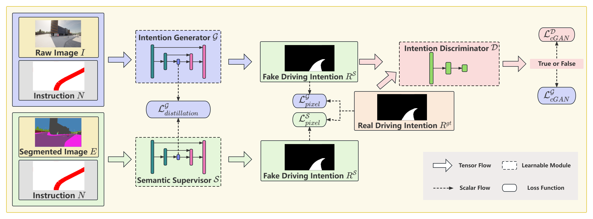

# Knowledge Distillation on Driving Intention Generator: Learn Human-like Semantic Learning
[](./LICENSE)

## Abstract
Semantic information plays a significant role in autonomous vehicles. However, it has remained open how to economically compute and efficiently incorporate semantic information into other frequently applied processes, such as construction of local navigation map, driving decision making and trajectories planning. To address this issue, we introduce *Knowledge Distillation* to convey semantic reasoning capability. Following the existing intention-guided framework, a semantically incorporated module associates given navigation instruction with acquired visual perception to synthesize driving intention. Our major contribution is to teach the driving intention generator how to propagate considering semantics implicitly. Specifically, we construct a semantic supervisor identical to the driving intention generator. The supervisor transfers semantic reasoning ability to the generator during training process, with which the generator is expected to perform stably and reliably even in extremely sophisticated surroundings or under frequently inaccurate navigation instruction. Through exhaustive experimental validation, our model demonstrates a superior robustness and adaptability compared to the state-of-the-art. Finally, we explain the intrinsic mechanism of our model with visualization.


<!-- https://github.com/BaiYeBuTingXuan/KD-LHSR/blob/main/doc/method.png -->

## Authors
- [__Hejun Wang__](mailto:hejun_wang@zju.edu.cn "The First Author")<sup>1</sup>
- Jiajun Dong<sup>1</sup>
- Yunkai Wang<sup>1</sup>
- Yanmei Jiao<sup>2</sup>
- [__Rong Xiong__](mailto:rxiong@zju.edu.cn "Corresponding Author")<sup>1</sup>

<sup>1</sup> Hejun Wang, Jiajun Dong, Yunkai Wang, Rong Xiong are with the State Key Laboratory of Industrial Control Technology and Institute of Cyber-Systems and Control, Zhejiang University, Hangzhou, China.

<sup>2</sup> Yanmei Jiao is with the School of Information Science and Engineering, Hangzhou Normal University, Hangzhou, China.
<!-- <sup>${\dagger}$</sup> The First Author, Email：<hejun_wang@zju.edu.cn>
<sup>${\ddagger}$</sup> Corresponding Author, Email: <rxiong@zju.edu.cn> -->


## Deployment

### Collecting Dataset
* Move to *./collect/* then run the python file *collect_sim_data.py*, then a dataset will be collected under *./collect/DATASET/0/*. You could change the dataset label to any interger or change the town or the weather, etc, according to instructions inline the file.
``` 
cd ./collect/
python collect_sim_data.py
```

* Run *collect_pm_data.py* to obtain ground truth for each dataset collected before. You could choose which dataset using parameter *--data*, according to instructions inline the file.
``` 
python collect_pm_data.py
```

### Training Model

* Move to *./train/* then run the python file *train.py*, a model will be trained. You should modify relative path inline the file, if nessary. 
``` 
cd ../train/
python train.py
```

### Testing

* In the end, you could test the model you has trained in your test dataset.